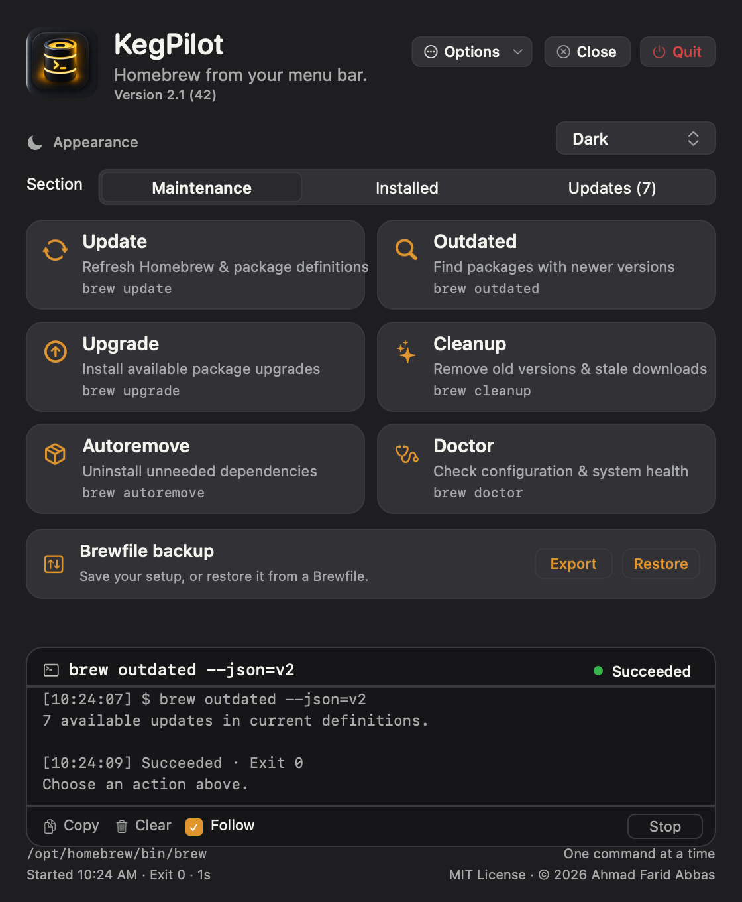
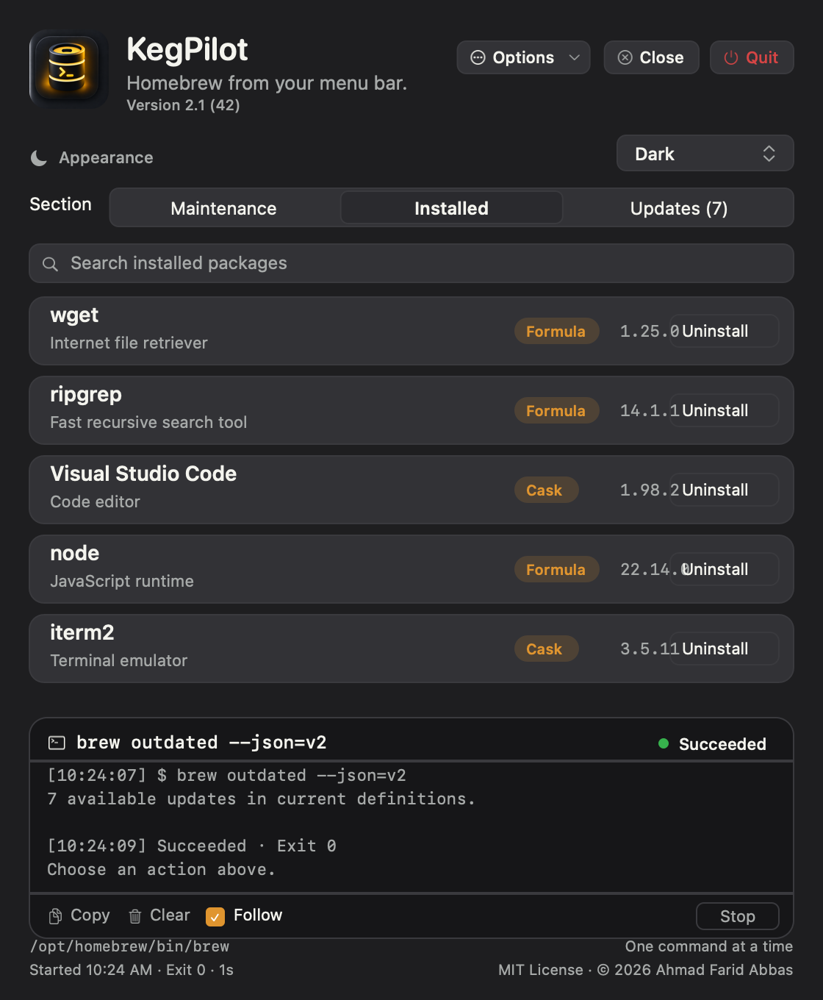
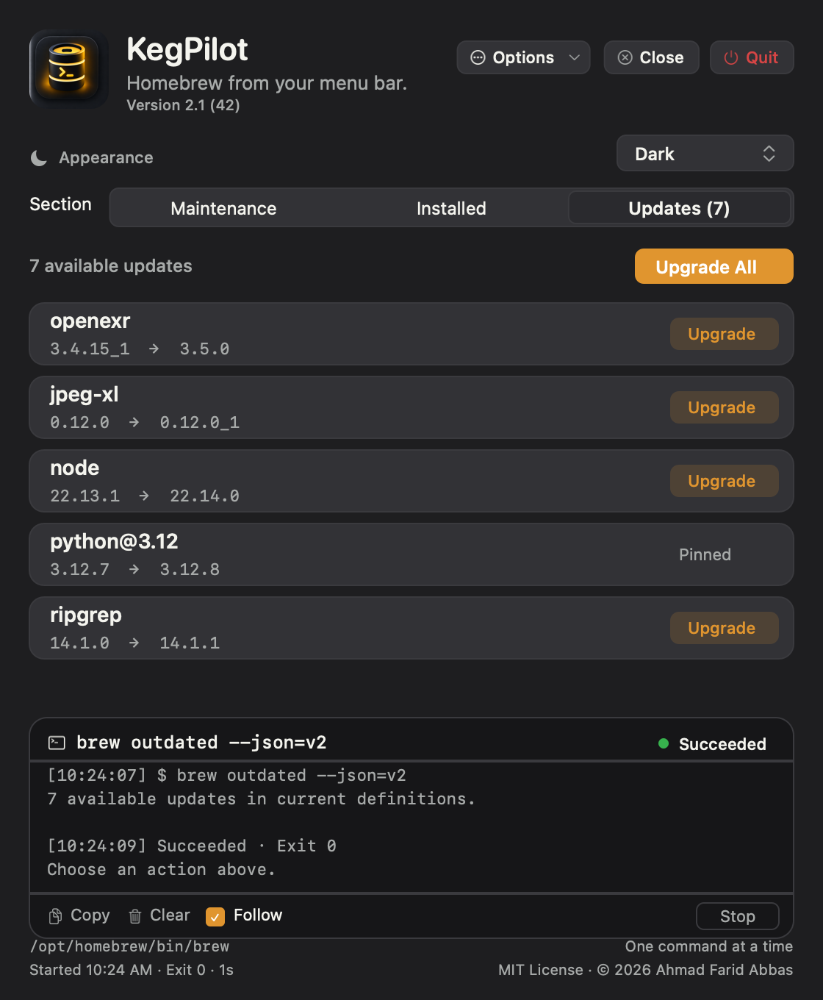

# KegPilot

A native SwiftUI menu-bar app for **Homebrew** on Apple Silicon, macOS 13 Ventura or newer. Run maintenance, browse installed packages, and manage updates from the menu bar with a live command console — no Terminal required.

**[Website & gallery](https://brewbar.netlify.app/)** · **[Download](https://github.com/ahmadfaridabbas/kegpilot/releases/latest)** · macOS 13+ · Apple Silicon


## 🔒 Your password is never stored

Some casks (like Zoom) run a `.pkg` installer that needs administrator rights. When Homebrew asks for your Mac password, KegPilot prompts you securely and passes it **straight to macOS `sudo`**. Your password is **never saved, never logged, never written to disk, never stored in the Keychain, never placed in command arguments or environment variables, and never sent over the network.** It is held in memory for a single Homebrew command, then discarded.

<details>
<summary><b>Details — how it works, for the technically curious</b></summary>

**In two lines:** the password lives only in RAM for one Homebrew command — typed into a masked `SecureField` → `BrewModel.passwordDraft`, handed to `AskpassBroker`, then written to a private `0600` FIFO (named pipe) that the `SUDO_ASKPASS` helper streams to `sudo`'s standard input. It is never placed in a command's arguments, in an environment variable, on disk, in the macOS Keychain, or in the console log.

**The full path your password takes**

- **While you type it:** an in-memory string bound to a masked `SecureField`. Nothing is written anywhere yet.
- **On Submit:** it is handed to a one-shot broker and the on-screen draft is cleared immediately.
- **Reaching sudo:** the broker writes it to a FIFO — an in-kernel pipe buffer, *not* a file on disk — inside a private per-command temp directory (mode `0700`, the pipe `0600`, owned only by you). A tiny helper script (the standard macOS `SUDO_ASKPASS` mechanism) reads from that pipe and passes the password to `sudo`. For a multi-step action (e.g. uninstalling an app that removes several services), you type it **once** and the rest are answered from memory.
- **When it's destroyed:** the draft is cleared on submit/cancel and whenever the prompt closes; the broker's in-memory copy and the temp pipe are deleted the instant the command finishes, is stopped, or the console is cleared. Nothing survives the command — let alone an app restart.

**Where it is _not_**

- Never in a command's arguments (`argv`) — `brew` and `sudo` are launched with fixed argument lists.
- Never in an environment variable — `SUDO_ASKPASS` holds the *helper's path*, not your password.
- Never in a regular file, the macOS Keychain, `UserDefaults`, or any preference.
- Never written to the console output, and never sent over the network.

**Honest caveats**

Swift strings aren't guaranteed to be zeroed by the runtime, so a transient copy may briefly remain in freed memory until reused — the same practical limit every GUI `sudo` front-end has. KegPilot best-effort zeroes its own byte buffer after use and holds the value only for one command. The entire mechanism is open source in [`src/Sources/KegPilot/AskpassBroker.swift`](src/Sources/KegPilot/AskpassBroker.swift), so you can read exactly what it does.

</details>

## The panel

Everything lives in one menu-bar window:

| Maintenance | Installed | Updates |
| --- | --- | --- |
|  |  |  |

- **Maintenance** — Update, Outdated, Upgrade, Cleanup, Autoremove, and Doctor, each a real `brew` command run with fixed, validated arguments.
- **Installed** — Browse installed formulae and casks with search, then uninstall with a confirmation. Homebrew's dependency checks stay active.
- **Updates** — See installed → current versions from `brew outdated`, and upgrade individually or all at once. Pinned packages are labeled.
- **Console** — Merged stdout/stderr in arrival order, timestamps, duration, and the real exit code. Stop escalates SIGINT → SIGTERM → SIGKILL.

Gallery images are native offscreen renders of KegPilot's interface, produced from its drawing code — not screen captures.

## Features

- Native SwiftUI `MenuBarExtra` panel with no Dock icon.
- **Search & Install:** search all of Homebrew from the Installed tab — each result shows its description, version, and installed-state — and install formulae or casks with a confirmation. The installed list refreshes automatically.
- System / Light / Dark plus **Papery Light** and **Papery Dark** themes, saved across launches, with matching artwork.
- A visible version line and Close / Quit controls in the header. Close tucks the panel away while KegPilot stays in the menu bar; Quit is blocked while a command is running.
- Live, streaming, noninteractive console with bounded retention, Copy, Clear, and Follow.
- Locates `brew` from your login environment and shows the resolved path.

## Install

1. Download and extract [KegPilot-2.1.zip](docs/downloads/KegPilot-2.1.zip).
2. Drag `KegPilot.app` to your Applications folder.
3. Because KegPilot is open source and not notarized by Apple, macOS quarantines it on download. Run this once in Terminal to let it launch:

   ```sh
   xattr -dr com.apple.quarantine /Applications/KegPilot.app
   ```
4. Click the Terminal Mug glyph in the menu bar to open the panel.

This is a locally (ad-hoc) signed build, not Apple-notarized. The command above clears macOS's quarantine flag so the app opens cleanly; alternatively you can right-click → Open the first time or approve it in Privacy & Security. KegPilot requires an existing Homebrew installation at `/opt/homebrew`.

## Publishing

See [PUBLISHING.md](PUBLISHING.md) for how the repository and website are structured and how to enable GitHub Pages.

## Status & licensing

KegPilot is an independent project and is not affiliated with or endorsed by Homebrew. It runs the `brew` binary already installed on your Mac. See [THIRD_PARTY_NOTICES.md](THIRD_PARTY_NOTICES.md).

KegPilot is released under the [MIT License](LICENSE). Copyright (c) 2026 Ahmad Farid Abbas.
